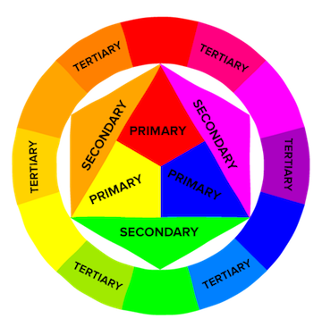
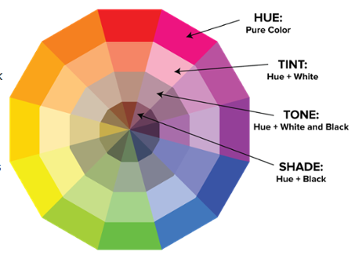
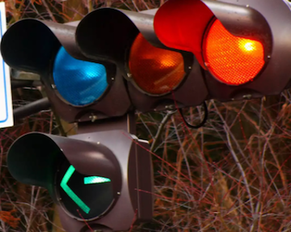
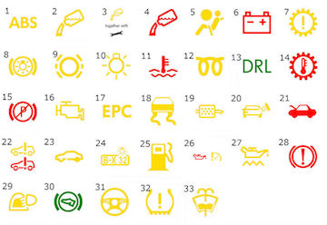
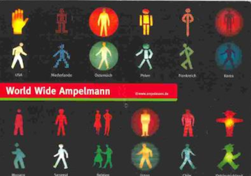
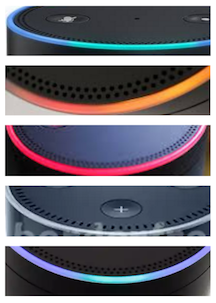

# Considerate Colorology
Playing with Sound & Light to create the ultimate ambiance

In this tutorial, I’ll cover the science and psychology behind color selection as well as show some fun ways color has been used in the world of IoT.

## Color Wheel 101

To understand effective use of color, we should start with the basics. This is the color wheel. In the 1660s, [Sir Isaac Newton](http://library.si.edu/exhibition/color-in-a-new-light/science) discovered that white light is composed of all colors when he noticed how light refracts through a prism and all colors are separated. He later arranged colors in a circle creating what is believed to be the first color wheel. Source

The basic color wheel is divided into primary, secondary, and teriary colors. Once you know this, you have the power to make any color! 

[Image Source](https://blog.hubspot.com/marketing/color-theory-design#sm.00001vh52wqrejd26zk5cy5vgy6zs)

Other important terminology include “hue” = pure color, “tint” = hue + white, “tone” = hue + white + black, and shade = hue + black.

[Image Source](https://blog.hubspot.com/marketing/color-theory-design#sm.00001vh52wqrejd26zk5cy5vgy6zs)

See here [for more advanced information](http://www.frontendplace.nl/bb/?cat=1) about color schemes such as how to make monochrome, analogous, and complementary schemes.

## Welcome to Neopixeland

Yayyyy! Neopixeland. Everyone’s favorite place. 

To kick things off, have you ever wondered how to create Chartreuse Green on your neopixel? Well, wonder no more! That and just about every other hue known to man (and woman) can be found at [this resource](http://www.tayloredmktg.com/rgb/) (or just google RGB codes).

The BLE Color Picker [(Adafruit Feather nRF52 Bluefruit LE - nRF52832)](https://www.adafruit.com/product/3406) is another cool way to get control over your color.

### Neopixel + Music

Let's take a closer look at one example of using light in a meaningful way. Scanning through the interwebs I found two beautiful examples and one abrassive one, although to be fair the abrasive example could be made more palatable with some minor brightness adjustments.

* Beautiful: [Multi hue visual amp + code](https://www.youtube.com/watch?v=pQwgZwrXfhc)
* Abrasive: [Multi hue (extremely bright) visual amp + code](https://youtu.be/c3DFLFITaG0)
* Beautiful: [Single hue visual amp + no code (booo)](https://www.youtube.com/watch?v=Vn39txtVIHc)

This tutorial will take a look at the first example listed above. For detailed schematic, the author generously posted his email: atheistic8@gmail.com. If you like his code, feel free to reach out! 

#### Parts:
1. Arduino Uno R3.
2. 4 x 12 pixel WS2812B addressable LED strips in parallel attached via 200 ohm resistor to pin 6 to limit current.
3. [Adafruit max 9814 autogain mic](https://www.adafruit.com/product/1713) attached to pin A0
4. 24 x Perspex / acrylic blocks in 2 x 12 sets held together with threaded rods and nuts (each set of 12 has 2 LED strips hotglued to the back so that they light up the blocks).
5. A 60cm x 40cm stainless steel shelf to sit the blocks on and reflect the light back.
6. Powered by 12000mAh External Battery Pack (PowerGen Power Bank Backup USB 5v Charger) with 1000uf electrolytic capacitor across +ve / -ve to protect strips when powering up. This avoids using a mains adapter and needing to be near a socket.

#### Arduino code:
A note from the author: "This was originally from [Programming Electronics Academy](https://programmingelectronics.com/) and the instructor, [Michael James](https://www.youtube.com/user/OSHJunkies), was an excellent teacher. PEA also has free "crash course" video in case you're interested in checking one of their courses out."

1. [Adafruit neopixel library](https://learn.adafruit.com/adafruit-neopixel-uberguide/overview)
2. Start with Adafruit’s mic code, which calibrates the sound level to whatever audio source.
3. The second part of the code maps the sound level onto 12 if statements so that when quiet it idles with the neopixel library rainbow but then as the sound level gets higher more effects are triggered.
4. Within each if statement there is a random() function so the display stays interesting. 
5. You can edit each individual strip pixel to create patterns in an infinite variety of ways and using the random () function you can keep on building so you never get bored.
6. The code works best with music with a wide dynamic range (soft and loud parts).

#### Links:
* [Video Source](https://www.youtube.com/watch?v=pQwgZwrXfhc) from original author
* [Code Source](http://textuploader.com/5bf3a) from original author
* Link to [folder](code) containing starter files

## Considerate Color
As an ethical product designer, when it comes to selecting light patterns and form factors try to keep [accessibility](https://www.arts.gov/sites/default/files/Design-for-Accessibility.pdf) top of mind.

### Color blindness
While only 1.3% of the US population is color blind, you should still think about designing for accessbility with everything you do and visual impairments are no exception.

| Type                | Men | Women | Total | 
|----------------------------------------|--------|--------|--------|
| Overall (United States) | - | - | 1.30% | 
| Red-green (Overall) | 7-10% | - | - | 
| Red-green (Caucasians) | 8% | - | - | 
| Red-green (Asians) | 5% | - | - | 
| Red-green (Africans) | 4% | - | - | 
| Dichromacy | 2.4% | 0.03% | - | 
| Protanopia (L-cone absent / red blind) | 1%-1.3% | 0.02% | - | 
| Deuteranopia (M-cone absent / green blind) | 1%-1.2% | 0.01% | - | 
| Tritanopia (S-cone absent / blue blind) | 0.001% | 0.03% | - | 

[Table Source](http://www.frontendplace.nl/bb/?cat=1)

When designing light patterns, be wary of yellow and certain blueish hues, which can appear white to all types of color blindness.

[Image Source](http://www.color-blindness.com/)

### Flicker Vertigo or Bucha Effect
Flicker Vertigo is defined as "an imbalance in brain-cell activity caused by exposure to low-frequency flickering (or flashing) of a relatively bright light." Examples of natural light patterns that can cause Flicker Vertigo include:
- Using electronics in low-light conditions for extended periods 
- Sunlight flickering through a tree-lined street 
- Sunlight reflecting off of water, especially off of rippling waves 
- Fixed wing flight Looking at or through a slowly spinning propeller

Ultra-sonic waves and strobe lights were even used as a means of crowd-control to induce acute discomfort, sickness, disorientation and sometimes epilepsy. [Source](https://en.wikipedia.org/wiki/Flicker_vertigo)

While the strobe effect can look cool at music festivals and other high energy environments, be kind and warn users your product may cause dizziness!

### Psychology of Color
The study of the science of color, sometimes referred to as chromotherapy, light therapy, or colorology, is a somewhat contentious subject given individuals and cultures respond to color differently. However, the following high level overview may be useful as a general guide to selecting colors.

#### Colorology from ancient Egypt & China 

* Red = stimulates body & mind to increase circulation 
* Yellow = stimulates nerves & purifies the body 
* Orange = heals the lungs & increases energy 
* Blue =soothes illnesses and treats pain 
* Indigo = alleviate skin problems

#### Modern research has found 

* Warm-colored placebo pills were more effective 
* Anecdotal evidence suggests blue-colored street lights reduce crime 
* People in warm climates tend to favorite cooler colors and vice versa 
* Red causes people to react with greater speed and force (eg. sports) 
* Sports teams in mostly black uniforms more likely to receive penalties

[Source](https://www.verywell.com/color-psychology-2795824)

## Color in the Real World

To create your own intuitive color patterns, start by looking at every day examples like the traffic light. 

Traffic lights adhere to international standards to reduce confusion for out-of-town drivers, and yet you'll still notice slight variations from region to region. In Japan, for example, the decision to use a blue light for “go” breaks conventional norms and [can cause quite the confusion](http://www.japantimes.co.jp/life/2013/02/25/language/the-japanese-traffic-light-blues-stop-on-red-go-on-what/#.WP9BQonyt0s) for international visitors! 

Building on these conventions, VW indicator lights follow a similar color code. 

- Green = FYI 
- Yellow = Possible Issue 
- Red = Stop & get service now

[Image Source](http://www.jennings-vw.com/blog/volkswagen-warning-lights-and-their-meanings/)

And even with international norms and conventions, people still manage to flex their creativity.  

[Image Source](https://ipuenktchenworld.blogger.de/stories/2344383/)

Finally, looking a bit closer to home, Alexa employs a similar use of color, but here we start to see more creativity such as orange, cyan, and violet coming into play.

|          Light pattern             |      Intended behavior |
|------------------------------------|------------------------|
| Solid blue with spinning cyan lights | The device is starting up. |
| Blue + cyan pointing in direction of person  | Alexa is busy processing your request. |
| Orange light spinning clockwise | The device is connecting to your Wi-Fi network. |
| Solid red light | You have turned off the microphones on your device. Press the Microphone button to turn on the microphones. |
| White light | You are adjusting the volume level on your device. |
| Continuous oscillating violet light | An error occurred during Wi-Fi setup. To learn more, go to Your Echo Device Doesn't Connect to Wi-Fi. |

[Source](https://www.amazon.com/gp/help/customer/display.html?nodeId=201602110)

Try to avoid uncessary cognitive load and design your light patterns so that they communicate meaning, not just visual noise.

### In summary: Have fun and be experimental, but not at the expense of your user. 

